# Practical Exercise 8: Virtual Reality and Photo scanning

**Meeting:** Wednesdays, 2:30 - 5:20, SMI 109

**Instructor:** Bo Zhao, SMI 416B, Office hours by appointment

**Contact:** 206.685.3846, zhaobo@uw.edu, jakobzhao (skype/wechat)


## 1. Preparations

### 1.1 Environment setup
For this practical exercise, you will use chrome, unity, and Agisoft Metagshape.

Background information is all from Wikipedia.

**Unity:** is a cross-platform game engine developed by Unity Technologies, first announced and released in June 2005 at Apple Inc.'s Worldwide Developers Conference as a Mac OS X-exclusive game engine. As of 2018, the engine had been extended to support more than 25 platforms. The engine can be used to create three-dimensional, two-dimensional, virtual reality, and augmented reality games, as well as simulations and other experiences. The engine has been adopted by industries outside video gaming, such as film, automotive, architecture, engineering and construction.

**Click [here](https://store.unity.com/?_ga=2.104680832.1844687138.1579259099-1474823435.1577053797#plans-individual) to Download website**;
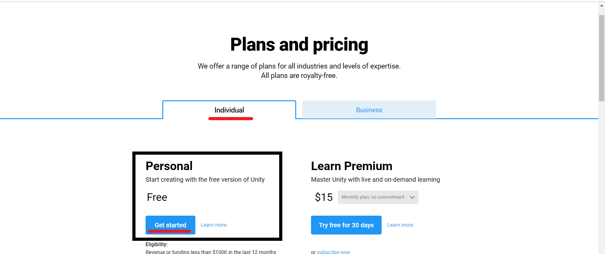
(Please select **Individual and Personal**, then press Get started for downloading)

**Agisoft Metashape :** is a stand-alone software product that performs photogrammetric processing of digital images and generates 3D spatial data to be used in GIS applications, cultural heritage documentation, and visual effects production as well as for indirect measurements of objects of various scales.

**Chrome** is a freeware web browser developed by Google. It was first released on September 2, 2008 for Microsoft Windows, and was later ported to Linux, macOS, iOS and Android. Google Chrome is also the main component of Chrome OS, where it serves as a platform for running web apps. Click here to see a demo on how to install Google Chrome.

> **What is 3D scanning?** 3D scanning is the process of analyzing a real-world object or environment to collect data on its shape and possibly its appearance (e.g. colour). The collected data can then be used to construct digital 3D models.

> **What is point clouds and Polygon mesh models?** The point clouds produced by 3D scanners and 3D imaging can be used directly for measurement and visualization in the architecture and construction world. In a polygonal representation of a shape, a curved surface is modeled as many small faceted flat surfaces (think of a sphere modeled as a disco ball). Polygon models—also called Mesh models, are useful for visualization, for some CAM (i.e., machining), but are generally "heavy" ( i.e., very large data sets), and are relatively un-editable in this form. Reconstruction to the polygonal model involves finding and connecting adjacent points with straight lines in order to create a continuous surface. Many applications, both free and nonfree, are available for this purpose.

> **What is 3D scanning?** 3D scanning is the process of analyzing a real-world object or environment to collect data on its shape and possibly its appearance (e.g. colour). The collected data can then be used to construct digital 3D models.

> **What is Texture?** An image texture is a set of metrics calculated in image processing designed to quantify the perceived texture of an image. Image texture gives us information about the spatial arrangement of color or intensities in an image or selected region of an image.


### 1.2 Unity Registration

A unity ID is needed for managing and synchronizing your unity project. If you do not have a Unity ID yet, please sign up at [https://id.unity.com/en/conversations/b8313a0d-8017-456b-aca8-fc9a81d895bc002f](https://id.unity.com/en/conversations/b8313a0d-8017-456b-aca8-fc9a81d895bc002f).

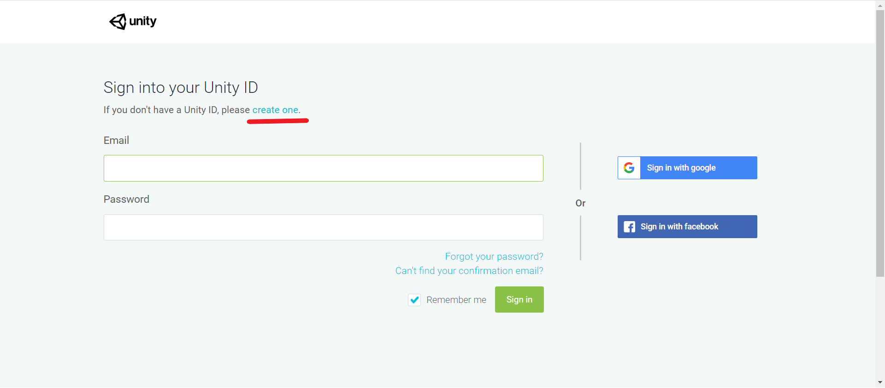

**Photo-scanning Reminds**

**Photo-scanning**

We are building a 3D model base on photo-scanning technology. Please use your phone/camera to take multiple images around your target. Ensuring the consistency of light is significant for creating a well-detailed model. The more pictures there are, the better the model would be.
Example of taking photos are here:
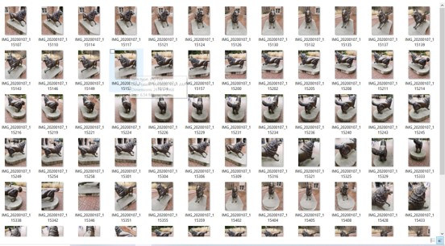

*The husky model that I did needs around 100 photos at least from multiple angles.*
> Example of photo scanning can be found in the folder named "Huskydog"

> A step-by-step tutorial on Agisoft turial

## 2\. Have a free trial Request

You can try Agisoft Metashape software either in demo mode (export and save functions are blocked) or test it in full function mode with 30-day trial license for free. Link: [https://www.agisoft.com/downloads/request-trial/](https://www.agisoft.com/downloads/request-trial/)

More information for the trail of using Agisoft Metashape:

*Please provide contact data in the form below. The trial license will be sent to the e-mail indicated. The key will allow to activate Agisoft Metashape Professional software and test it in full function mode for 30 days. If you would like to test Agisoft Metashape Standard, please contact us at sales@agisoft.com.*

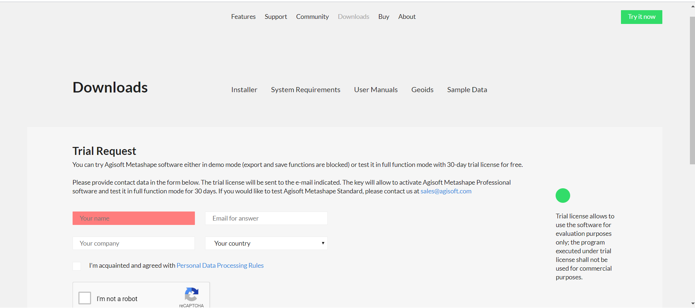

After you successfully have the activate code from Agisoft, you should be able to download your software from this page.

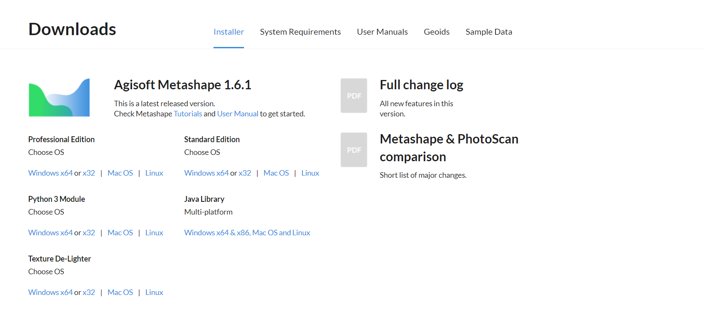

Remember we want to install **Agisoft Metashape**.
Then, you just need to follow the instruction of the software.

## 3\. Now let's create our 3D model.

1\. **Agisoft Metashape** is a stand-alone software product that performs photogrammetric processing of digital images and generates 3D spatial data to be used in GIS applications, cultural heritage documentation, and visual effects production as well as for indirect measurements of objects of various scales.

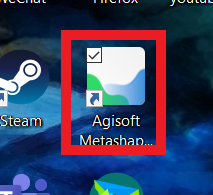


2\. Once you open the software, you enter the main interface of this software.


In this user interface, all of our operations are located on these four colored squares. The largest square with the red color is where our 3D model presents. The circle in the center is a tool for us to navigate our 3D model. It has three-axis (X, Y, Z). Use your mouse to drag on each axis for different angels.


3\. The square with the blue color is where our photo appears. You can select each camera position/photo individually.
The square with the green color is our manual toolbar. It provides function with saving, opening, clicking, zooming, and deleting.
The yellow square is the same manual tab but in words instead of icons. Here, we shall take a glance at our project.


4\. Next, we need to click the workflow tab. Then, we have to select add photos or add Folder. (If you are using Add Folder, please remember to pick “single cameras”).
Personally, I always use “add photos” because it is easier to see all the pictures that you are planning to use.


5\. After you have added all the photos, you shall see them pop out on the workspace area (the square on the left). You shall also notice the dots on your model interface. Each dot represents a virtual camera position,  and the computer uses these dots to align photos for creating a 3D realistic environment.
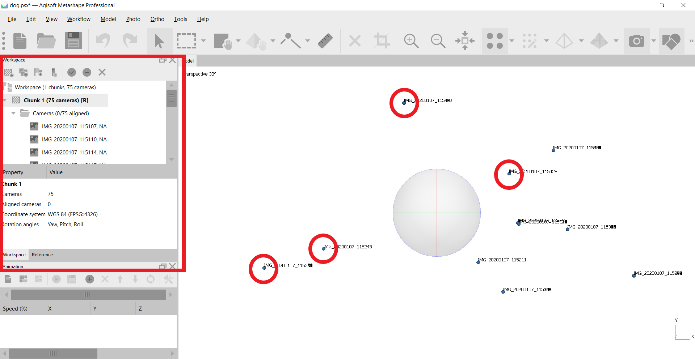


Before we enter the next phase, I strongly recommend you to check the preference setting under the tools.

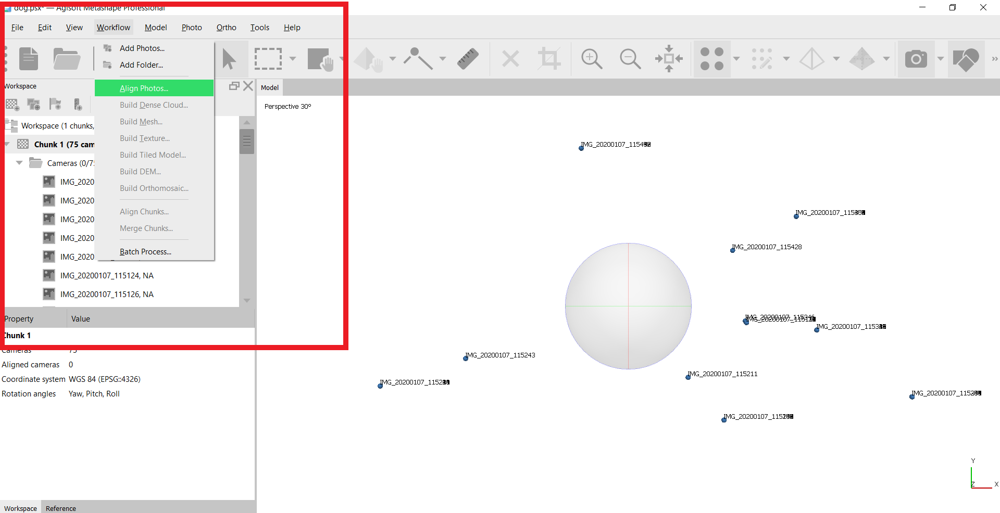

Here, you can change the language or all the default settings. You can check your GPU for the 3D modeling. I would recommend you to select the box for using CPU when performing GPU accelerated processing. Basically, this function splits the large amounts of work between GPU and CPU, and it should reduce your waiting time.

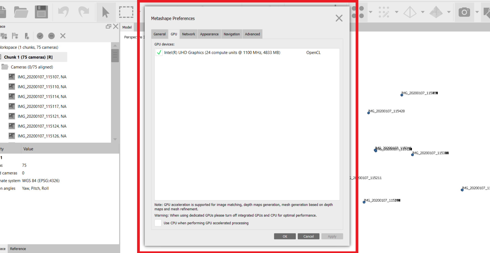

 ```Workflow
 Align Photos
 Build Dense Cloud
 Build Mesh
 Build Texture

 ```
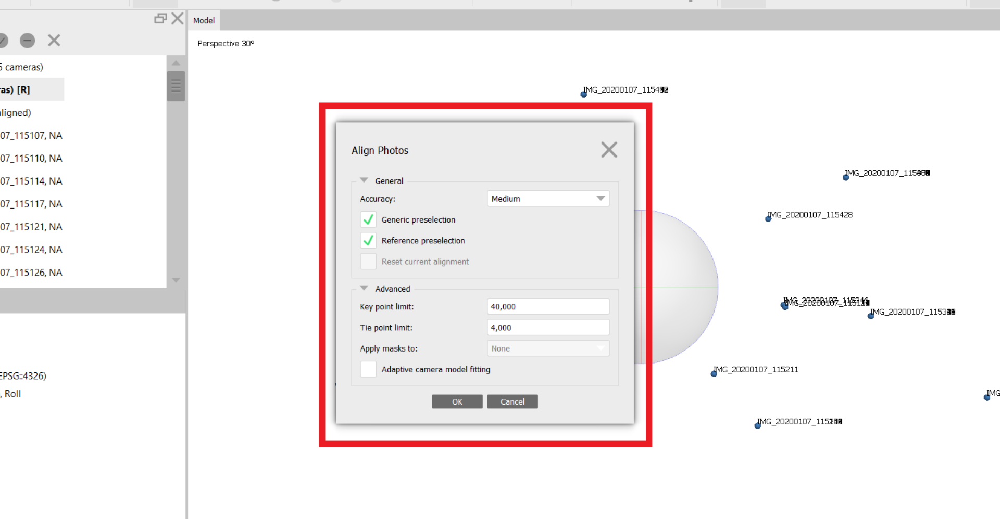

**To simplify 3D model**

If you just want to run/finish the 3D model of the husky dog(in this example), I would strongly suggest you of using the Area Select tool(red square) and delete button on your keyboard to simply the model. As you can see from the screenshot, the blue circled areas are irrelevant background(reference dot points), which is not necessary for our goal --- 3D scanning of the husky dog.

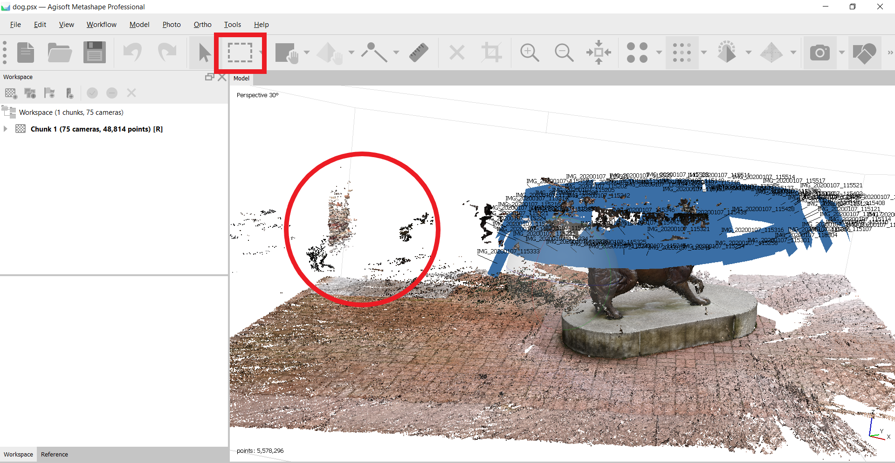

In this case, everything that you deleted would not be calculated or projected on the final stage.

6\. As you can see after the construction of 3D mesh and dense cloud, this basically builds up the final 3D model. However, we still have the last step to do --- polish the model.

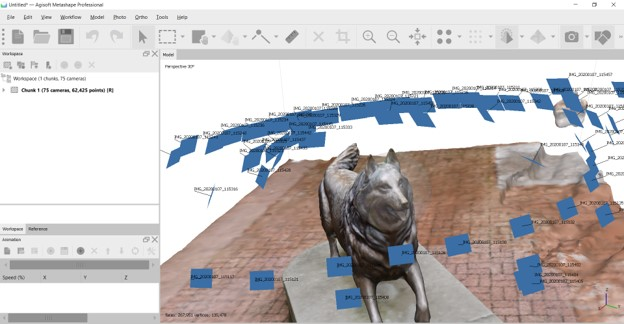

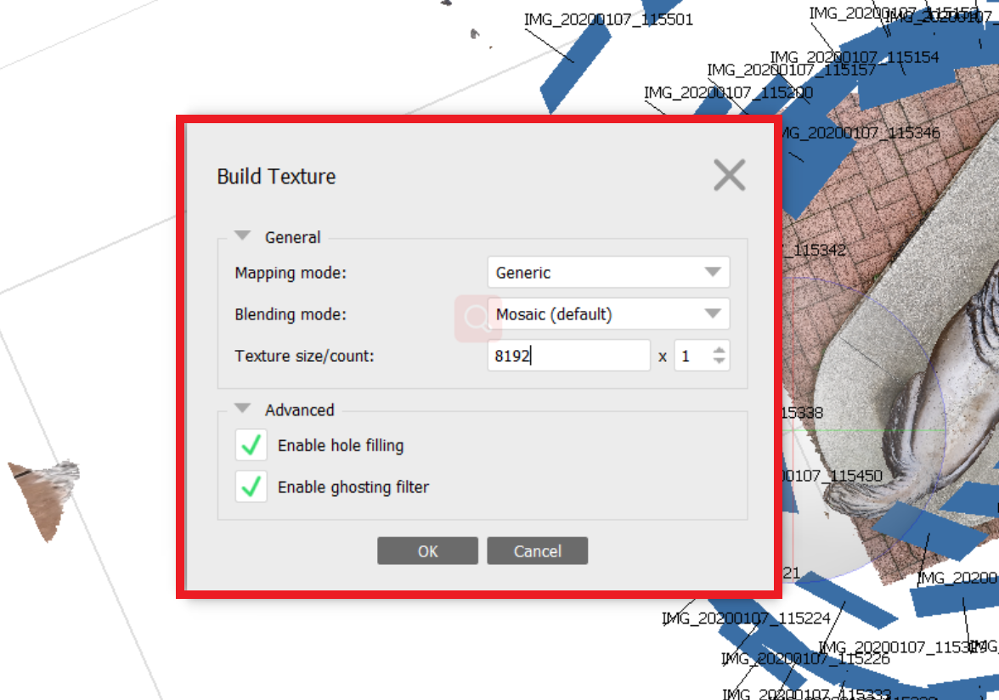

The higher the texture size is, the better your model is going to appear in the final model.  

**Texture size recommend: 8192 / 4096 / 2048 / 1024**
**Remember to save your model first.**

7\. Then use the File, Export, Export Model.


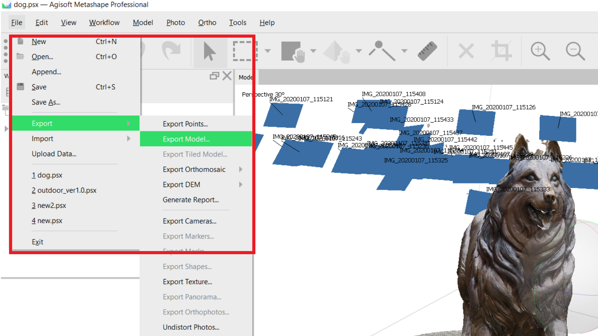
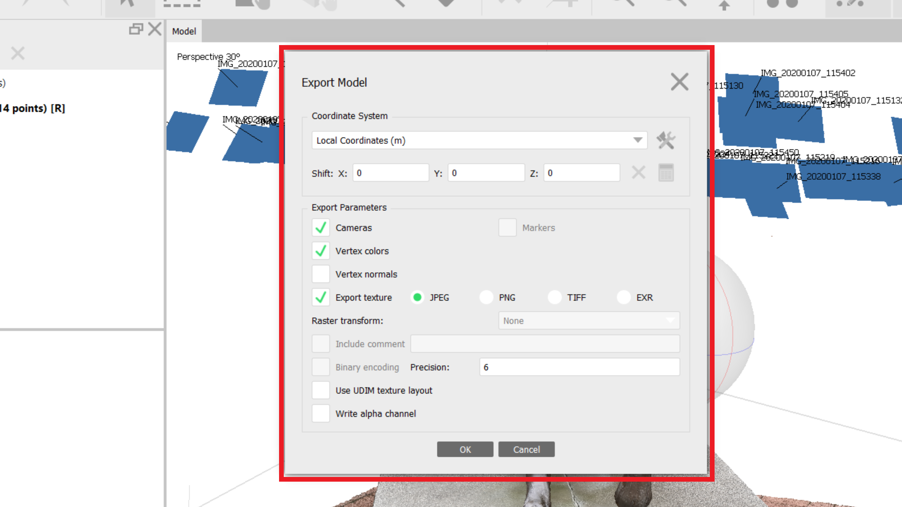

You are welcome to adjust any setting if you want. Shift X, Y, Z coordinate --- move/rotate the actual model
The model could be *DAE, OBJ, FBX*.
Export texture in the image: *JPEG, PNG, TIEF, EXR*

8\. Remember you need a unity account to start the next part!!!!(Tutorial 1.1 - 1.2)

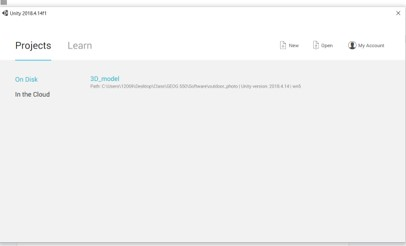

I strongly recommend you to watch this tutorial from 1:35 --- 5:00.
Also, please use a mouse to control unity. This case will save a lot of time instead of using the touchpad.

([Click here to watch](https://www.youtube.com/watch?v=IlKaB1etrik&list=PLPV2KyIb3jR5QFsefuO2RlAgWEz6EvVi6&index=2))

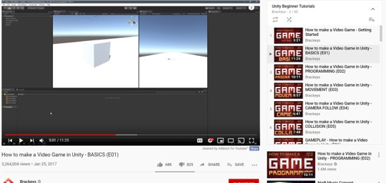

9\. At the bottom of the Assets window: use import.

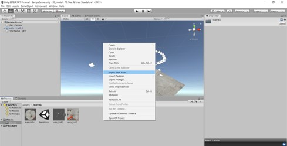

Select the model you exported earlier from Agisoft and the texture.
[PLEASE import them at once, like what I did in the image below. In this case, the texture should automatically be recognized and attached to the 3D model. If your model still appears with empty texture, you can manually drag the texture onto the model to finish it.]


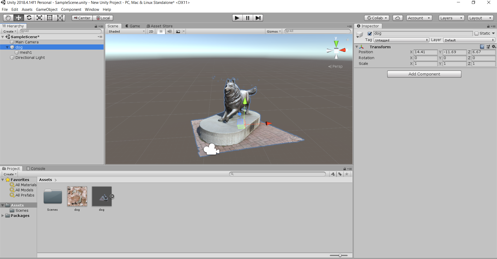

Congrats! Now your 3D model is done. You can just adjust the position/camera for your VR.
To activate the VR setting in Unity just go through this website.
([Click here to watch the VR setting in Unity](https://docs.unity3d.com/Manual/VROverview.html)

### VR experience
>*Virtual reality (VR)* is a simulated experience that can be similar to or completely different from the real world. Applications of virtual reality can include entertainment (i.e. video games) and educational purposes (i.e. medical or military training). Other, distinct types of VR style technology include augmented reality and mixed reality.
>Currently standard virtual reality systems use either virtual reality headsets or multi-projected environments to generate realistic images, sounds and other sensations that simulate a user's physical presence in a virtual environment. A person using virtual reality equipment is able to look around the artificial world, move around in it, and interact with virtual features or items. The effect is commonly created by VR headsets consisting of a head-mounted display with a small screen in front of the eyes, but can also be created through specially designed rooms with multiple large screens. Virtual reality typically incorporates auditory and video feedback, but may also allow other types of sensory and force feedback through haptic technology.

In my experiment, you can take a glance at the potential of Virtual Reality. Imaging we recreate our world in the a massive computer game, we can approach to so many things that we could not do in reality. There is already study for using VR to help people recover from PTSD. There are also studies focus on the entertainment, the social experiment, and the psychological phenomena in VR. Although the future looks prominent, there are still some minor issues of VR.

>Motion sickness occurs due to a difference between actual and expected motion. Symptoms commonly include nausea, vomiting, cold sweat, headache, sleepiness, yawning, loss of appetite, and increased salivation. Complications may rarely include dehydration, electrolyte problems, or a lower esophageal tear.

>User Isolation occurs due to the usage of virtual reality. The players sink into their world with little notice to the actual world. This sort of isolation could lead to anxiety and frustration.

## 4. Deliverable

Before submitting the deliverable, please make sure the **GitHub Pages** work properly. You are expected to submit the url of the GitHub repository to the **Canvas Dropbox** of this course. This url should be in the format of `https://www.github.com/[github_username]/[github_username].github.io`. To submit, check the item of this lab on the assignment tab, and then press the `Submit Assignment` button. Please contact the instructor if you have any difficulty in submitting the url link. Here are the grading criteria:


**Note:** Lab assignments are required to be submitted electronically to Canvas unless stated otherwise. Efforts will be made to have them graded and returned within one week after they are submitted.Lab assignments are expected to be completed by the due date. ***A late penalty of at least 10 percentage units will be taken off each day after the due date.*** If you have a genuine reason(known medical condition, a pile-up of due assignments on other courses, ROTC,athletics teams, job interview, religious obligations etc.) for being unable to complete work on time, then some flexibility is possible. However, if in my judgment you could reasonably have let me know beforehand that there would likely be a delay, and then a late penalty will still be imposed if I don't hear from you until after the deadline has passed. For unforeseeable problems,I can be more flexible. If there are ongoing medical, personal, or other issues that are likely to affect your work all semester, then please arrange to see me to discuss the situation. There will be NO make-up exams except for circumstances like those above.
